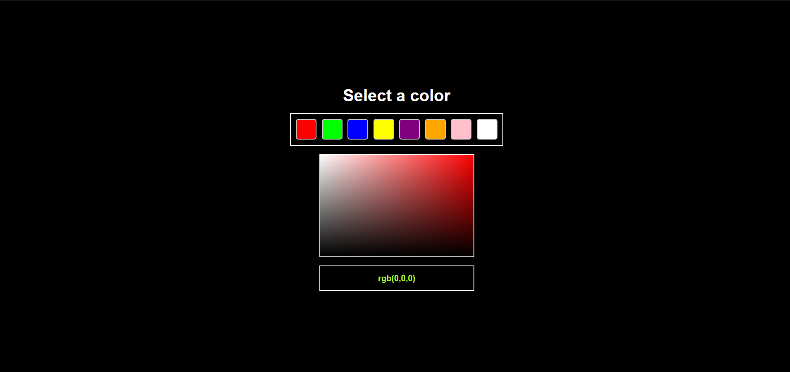
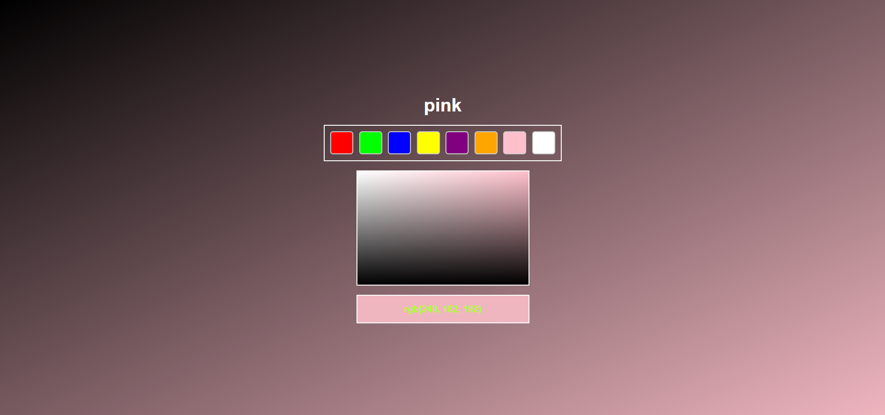

# 🎨 Dynamic CSS Color Picker & Shade Generator

An interactive web tool that allows users to **select a base color** from a color palette and **generate dynamic shades and tints** in real-time using mouse movement. Built entirely with **HTML, CSS, and JavaScript** — no libraries or frameworks required.

---

## 📌 Features

- ✅ Click to select a base color from the palette  
- 🎚️ Real-time shade & tint generation via mouse movement  
- 🧠 Displays live `rgb()` color codes as you hover  
- 🌈 Visually rich gradients and dynamic transitions  
- ⚡ 100% client-side — no external dependencies  

---

## 📸 Live Preview

> ✨ *Hover over the preview box to explore dynamic color variations*




---

## 🚀 Getting Started

### 🔗 Live Demo

Explore it now:  
🌐 **<a href='https://ankit-dalei.github.io/Color/](https://color-tau-two.vercel.app/' target='1'>Live Website</a>**

---

### 🛠️ Run Locally

Clone the repository and open it in your browser:

```bash
git clone https://github.com/Ankit-Dalei/Color.git
cd Color
start index.html     # On Windows
# or
open index.html      # On macOS
